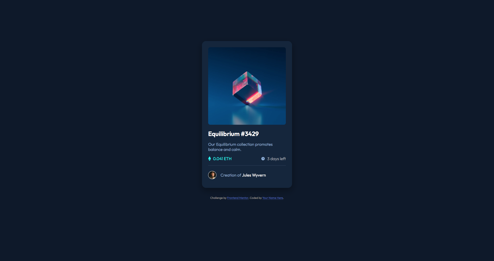

# Frontend Mentor - NFT preview card component challenge

This is a solution to the [NFT preview card component challenge on Frontend Mentor](https://www.frontendmentor.io/challenges/nft-preview-card-component-SbdUL_w0U). 

## Table of contents

- [Overview](#overview)
  - [The challenge](#the-challenge)
  - [Links](#links)
- [My process](#my-process)
  - [Built with](#built-with)
  - [what I learned](#what-i-learned)
  - [Useful resources](#useful-resources)
- [Author](#author)

## Overview

### The challenge

Users should be able to:

- View the optimal layout depending on their device's screen size
- See hover states for interactive elements

## links

- [Solution URL](https://github.com/Illyaas4Show/NFT-preview-card-component)
- [Live Site URL](https://dapper-daifuku-c62476.netlify.app)

## My process

At first I started this challenge feeling confident, following the success of my previous challenge, but I later hit a roadblock when I got to centering the icons to text next to it. The Icons were slightly offset for reasons I didn’t understand and I tried every way to centre an element that I knew of. I later searched on youtube for help and found that simply displaying as flex solves the problem simply! When I was done with that part, the rest was pretty fun.

### Built with

- HTML (semantic)
- CSS custom properties
- Flexbox
- Mobile-first workflow

### What I learned

I learn the importance of using the right styling on the right parent element in order to achieve a certain goal. For example, using position absolute on the element and using position relative on the parent element.

### Useful resources

- [tsbsankara](https://www.youtube.com/watch?v=9bGbykdR4T8)

## Author
- [GitHub](https://github.com/Illyaas4Show/)

Thank you for viewing :smile:
